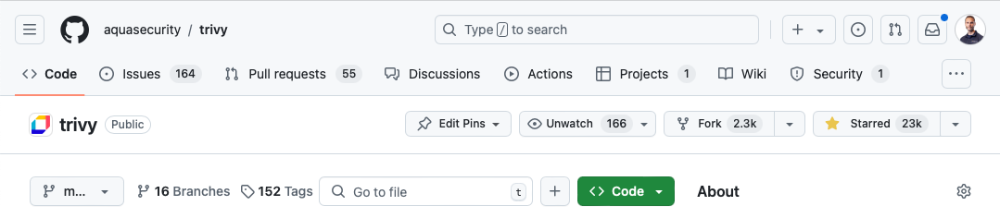

October 2024

Itay Shakury @itaysk

---

# Trivy is..
### Unified
### Open Source
# Security scanner

---

# Unified

<h2> Targets </h2>
    <ul style="list-style-type: none">
        <li> 📜 Code </li>
        <li> 🎆 Binary </li>
        <li> 📦 Image </li>
        <li> 🏭 Kubernetes </li>

    <h2> Scanners </h2>
    <ul style="list-style-type: none">
        <li> 🐛 Vulnerabilities </li>
        <li> 🪟 Misconfigurations </li>
        <li> 🤐 Secrets </li>
        <li> 🪪 Licenses </li>
    </ul>

---

# Open Source

<https://github.com/aquasecurity/trivy>

---

# DEMO

---

# There's more

---

# And more

---

# And more

---

# Resources

### 🧑‍🔬 Use | 💬 Discuss | 🧑‍💻 Contribute

- <https://github.com/aquasecurity/trivy>
- <https://aquasecurity.github.io/trivy>
- <https://x.com/aquatrivy>

---

October 2024

Itay Shakury @itaysk

